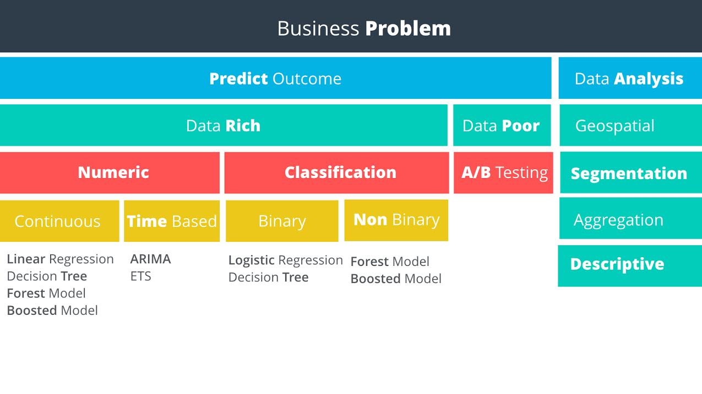

## Ask the following questions to understand the business issue:
* What decision needs to be made?
* What information is needed to inform that decision?
* What type of analysis is needed to get the information needed to make that decision?

## Linear regression for predictions

A scatterplot that shows the plots in a line..
A line is drawn on the plots.
Using the line, you can predict the later or future plots.

y = mx + b
the `y` is the variable on the y axis - target variable, or the reason for the model used
the `x` is the variable on the x axis - predictor variable, or the game changer

`m` = slope of line
`b` = y-interscept

Slope function    `SLOPE(data_y, data_x)`
Intercept function    `INTERCEPT(data_y, data_x)`

